# Multi-Agent Simulation Framework - UML Diagrams
## Architecture Flow and Component Interactions

**Version:** 1.0  
**Date:** 2026-02-05  
**Companion Document:** SIMULATION_SPEC.md

---

## 1. System Architecture Overview

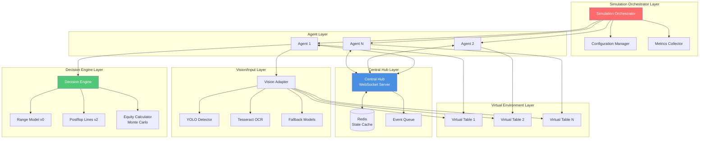

---

## 2. Agent Lifecycle Sequence

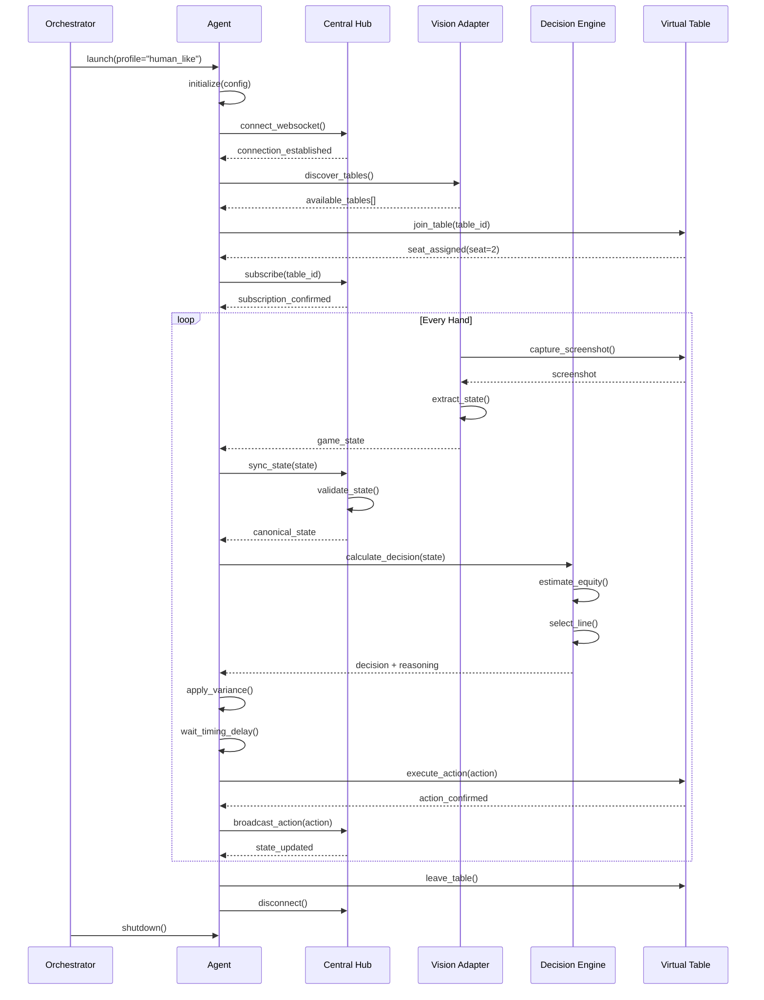

---

## 3. State Synchronization Flow

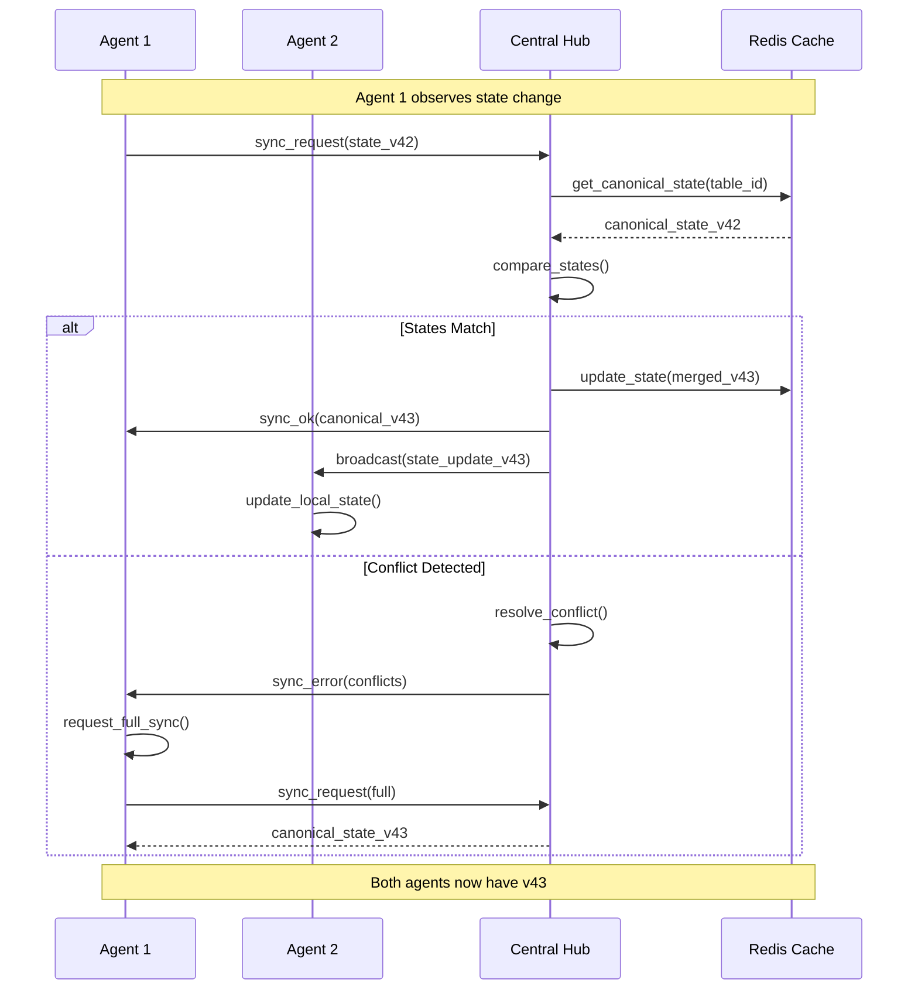

---

## 4. Decision Engine Component Diagram

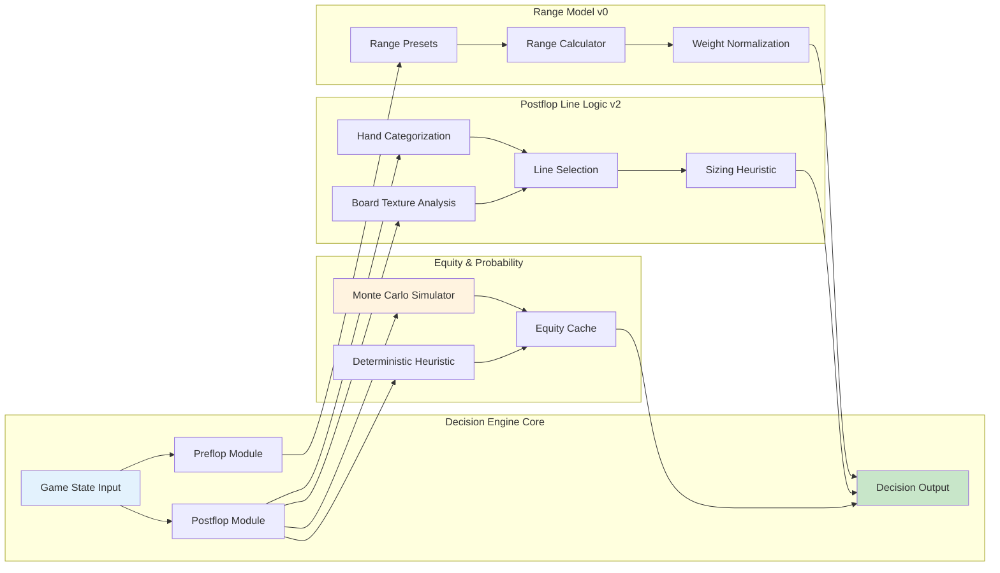

---

## 5. Conflict Resolution State Machine

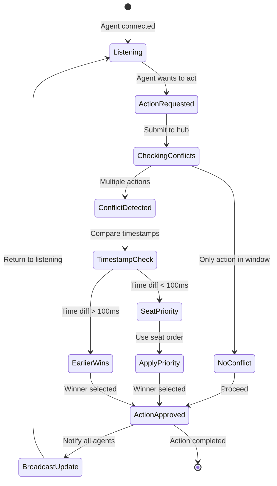

---

## 6. Vision Input Pipeline

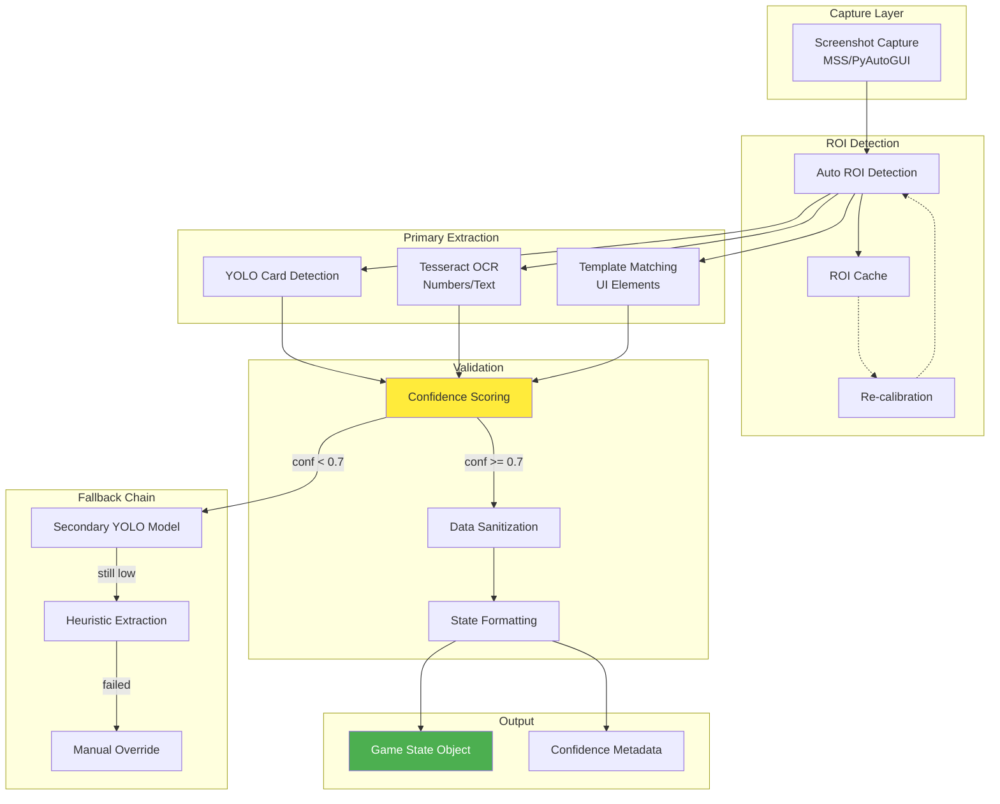

---

## 7. Variance Model Application Flow

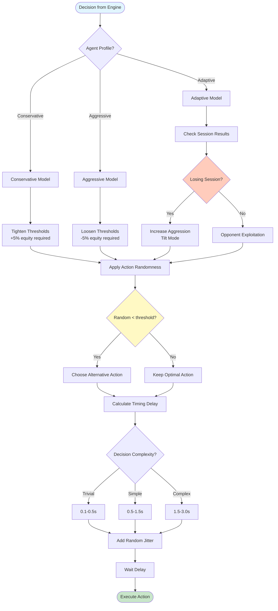

---

## 8. Multi-Agent Orchestration Architecture

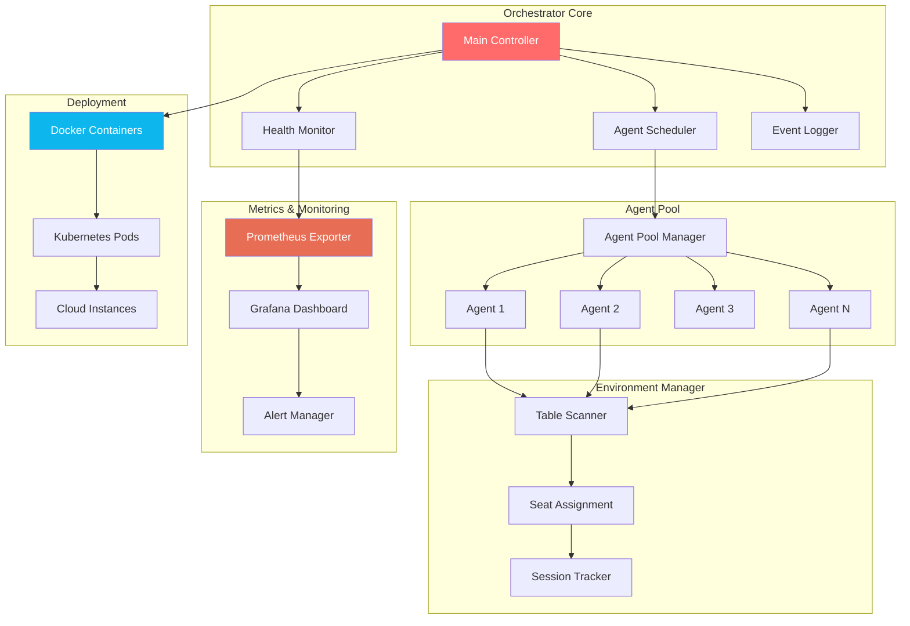

---

## 9. WebSocket Communication Protocol

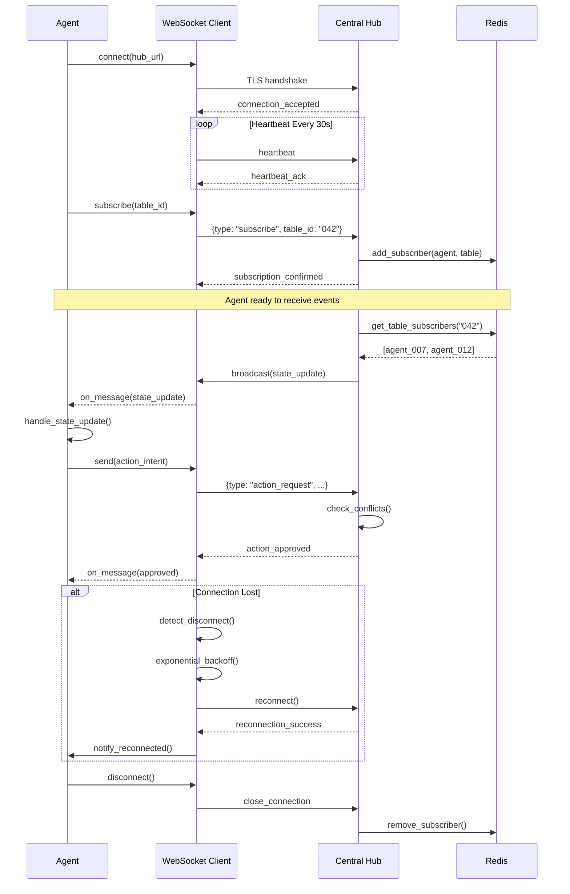

---

## 10. Data Flow: Vision Input → Coordinated Action

```mermaid
flowchart LR
    subgraph "Input Stage"
        V1[Virtual Table<br/>Screenshot]
        V2[Vision Adapter]
        V3[State Extraction]
    end
    
    subgraph "Synchronization Stage"
        S1[Agent Local State]
        S2[Central Hub]
        S3[Canonical State]
        S4[Conflict Check]
    end
    
    subgraph "Decision Stage"
        D1[Opponent Models]
        D2[Decision Engine]
        D3[Equity Calculation]
        D4[Line Selection]
    end
    
    subgraph "Coordination Stage"
        C1[Action Intent]
        C2[Hub Validation]
        C3[Multi-Agent Sync]
        C4[Approval]
    end
    
    subgraph "Execution Stage"
        E1[Variance Applied]
        E2[Timing Delay]
        E3[Action Execution]
        E4[Confirmation]
    end
    
    V1 --> V2 --> V3 --> S1
    
    S1 --> S2
    S2 --> S3
    S3 --> S4
    S4 -->|OK| D1
    S4 -->|Conflict| S2
    
    D1 --> D2
    D2 --> D3
    D3 --> D4
    D4 --> C1
    
    C1 --> C2
    C2 --> C3
    C3 --> C4
    C4 -->|Approved| E1
    C4 -->|Denied| C1
    
    E1 --> E2 --> E3 --> E4
    
    E4 --> S2
    
    style V1 fill:#e3f2fd
    style S3 fill:#fff9c4
    style D4 fill:#c8e6c9
    style C4 fill:#ffccbc
    style E4 fill:#b39ddb
```

---

## 11. Class Diagram: Core Components

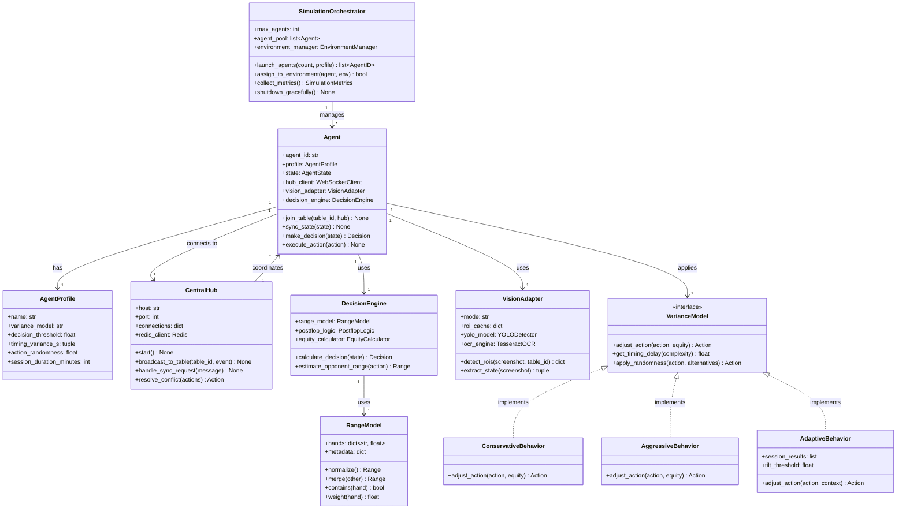

---

## 12. Deployment Architecture

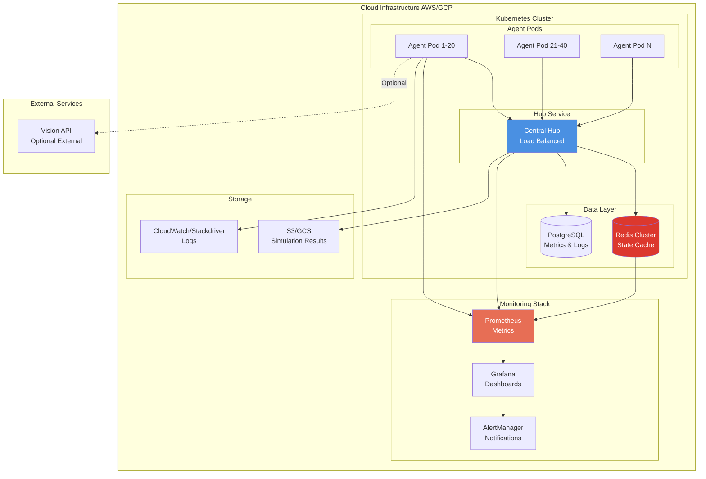

---

## Appendix: Legend and Conventions

### Diagram Types
- **Sequence Diagrams:** Show temporal flow of messages between components
- **State Machines:** Represent state transitions and decision logic
- **Flowcharts:** Illustrate algorithmic processes and data transformations
- **Component Diagrams:** Display static structure and relationships
- **Architecture Diagrams:** High-level system organization

### Color Coding
- 🔵 **Blue:** Core infrastructure (Hub, Orchestrator)
- 🟢 **Green:** Decision/output stages
- 🟡 **Yellow:** Validation/checking stages
- 🟠 **Orange:** Monitoring/metrics
- 🔴 **Red:** Critical/error paths
- ⚪ **Gray:** External systems

### Notation
- `→` Synchronous call
- `-->` Response/return
- `-.->` Optional/conditional
- `⇄` Bidirectional communication
- `[*]` Terminal state

---

**Document Version:** 1.0  
**Last Updated:** 2026-02-05  
**Companion:** SIMULATION_SPEC.md  
**Tools Used:** Mermaid (mermaid.js)

**Viewing Instructions:**
- These diagrams use Mermaid syntax
- View in GitHub, GitLab, or Mermaid Live Editor
- VS Code: Install "Markdown Preview Mermaid Support" extension
- Obsidian: Native Mermaid support

**Educational Use Only**
